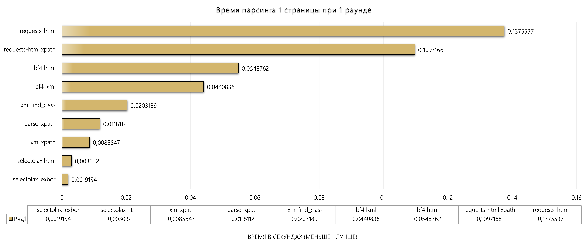
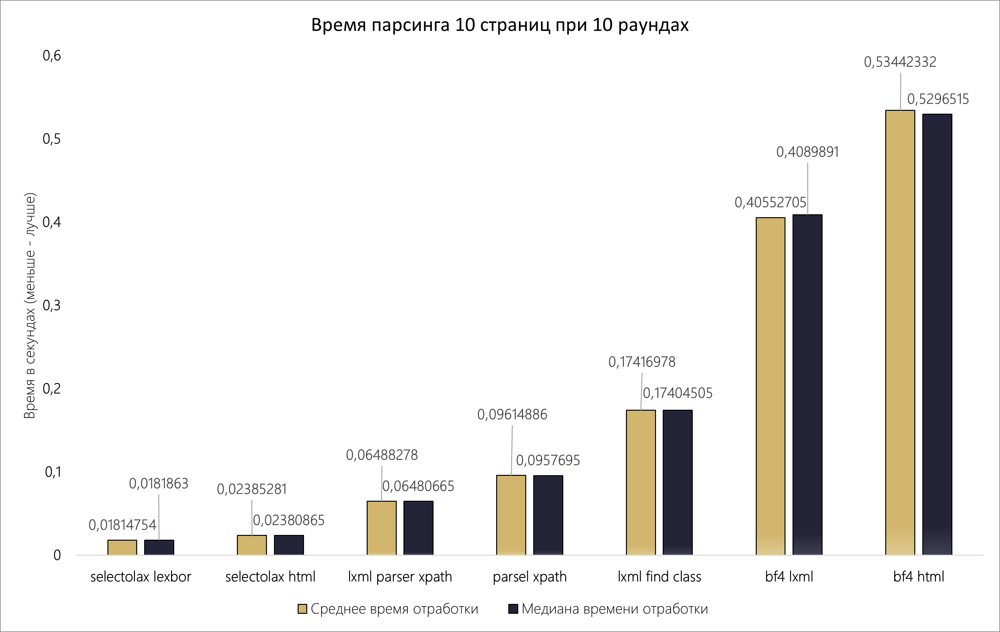
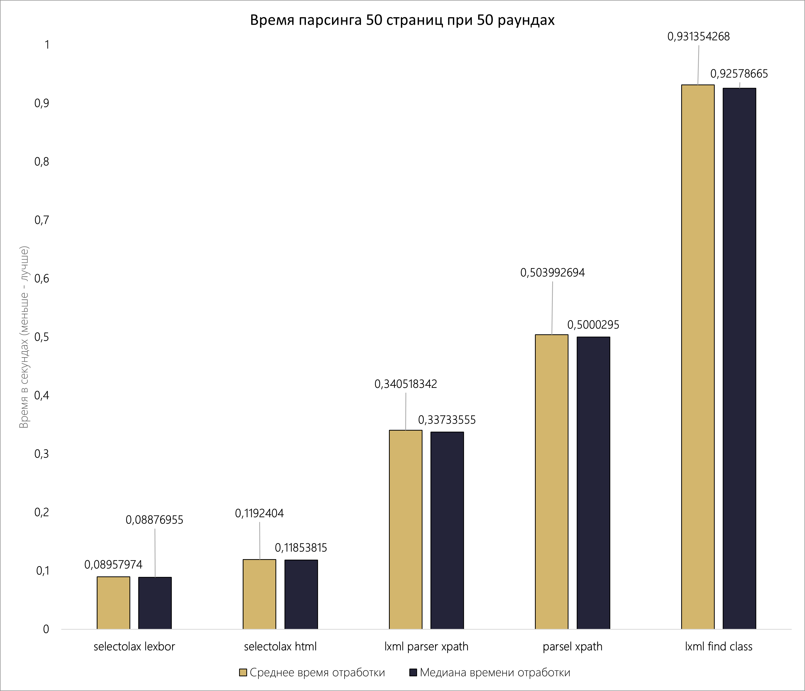

# Бенчмарк HTML парсеров в Python: сравнение скорости

[Статья на Хабр](https://habr.com/ru/companies/vsk_insurance/articles/780500/)

В качестве задачи используем поисковик, нашего любимого habr.com, в который отправим запрос с 
ключевыми словами «html parsing python» и соберём следующие данные по каждой статье: 
имя автора, заголовок, дату создания статьи, количество просмотров и голоса (оценки).

### Участники:
*	BeautifulSoup4, версия 4.12.2
*	lxml, версия 4.9.3
*	requests-html, версия 0.10.0
*	parsel, версия 1.8.1
*	selectolax, версия 0.3.17

```
Python 3.12.0
```

### Модули
- decorator_and_selectors.py - селекторы и декоратор таймера
- parser_and_benchmark.py - основные функции запуска парсера и бенчмарка
- parsing_functions.py - методы парсинга


Принцип работы скрипта: с помощью requests осуществляем запрос на получение страницы, сохраним 
content ответа и поочерёдно проведём парсинг различными методами, фиксируя время выполнения с 
помощью декоратора.

### Бенчмарк

*	requests-html: несмотря на то, что использует «под капотом» BeautifulSoup, показывает наиболее худшие результаты. Если использовать XPath, вместо CSS результат улучшается примерно на 25%, на даже такой метод хуже варианта BeautifulSoup с использование парсера «lxml» 59,8 %
*	BeautifulSoup4: использование парсера «lxml», вместо «html.parser» ускоряет работу на 24,5%
*	lxml: использование метода поиска «find_class», хуже чем использование привычного XPath на 57,75%
*	selectolax: показывает лидерство


*	позиции участников никак не изменились
*	BeautifulSoup4: на дистанции, использование парсера «lxml», вместо «html.parser» ускоряет работу на 31,8%
*	lxml: на дистанции, использование метода поиска «find_class», хуже чем использование привычного XPath на 62,75%
*	selectolax: показывает лидерство, использование «LexborHTMLParser» быстрее, чем «HTMLParser» на 31,44 %
*	parsel: показывает средние результаты среди всех участников


### Результаты и выводы:
*	используя selectolax с «LexborHTMLParser» вы получите информацию быстрее, по сравнению с:
      *	selectolax с «HTMLParser» в 1,33 раза            
      *	lxml в 3,8 раза      
      *	parsel в 5,6 раза
      *	BeautifulSoup4 в 24,5 раза
      *	requests-html в 62,9 раза
*	используя lxml на XPath вы получите информацию быстрее, по сравнению с:
      *	parsel в 1,5 раза
      *	BeautifulSoup4 в 6,4 раза
      *	requests-html в 16,5 раз
*	парсеры selectolax HTML и Lexbor невероятно быстры и является лидерами во всех тестах
*	парсер lxml используется и в BeautifulSoup4, и в parsel, но parsel превосходит BeautifulSoup4 с lxml «под капотом»
*	кроме selectolax, использующего CSS селекторы, во всех остальных случаях применение XPath (при поддержке) давало прирост скорости


